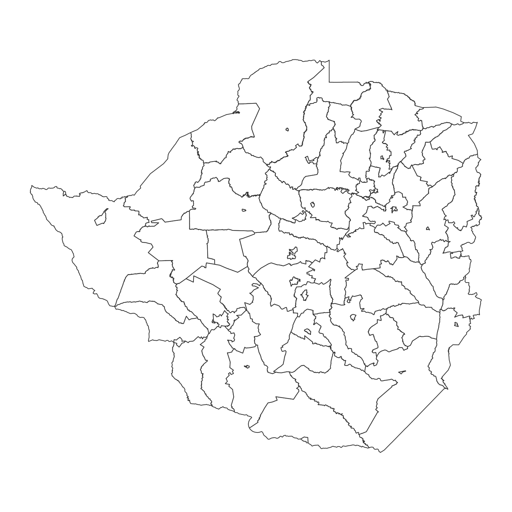

# Zimbabwe mapping

Zimbabwe GIS mapping tests.

## Links

* https://en.wikipedia.org/wiki/Land_reform_in_Zimbabwe
* https://welections.wordpress.com/2013/08/08/zimbabwe-2013/

## Data sources

* http://ghdx.healthdata.org/organizations/central-statistical-office-zimbabwe
* http://zimbabwe.opendataforafrica.org/
* https://www.who.int/hac/crises/zwe/maps/en/

